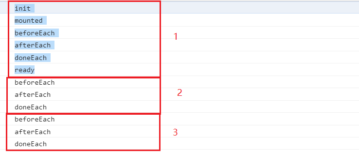

# 开发插件

docsify 提供的钩子（hook）支持处理异步逻辑，可以扩展功能。 

钩子的生命周期函数

```js
window.$docsify = {
 plugins: [
  function (hook, vm) {
    hook.init(function() {
      // 初始化时调用，只调用一次，没有参数。
    })

    hook.mounted(function() {
      // 初始化完成后调用，只调用一次，没有参数。
    })

    hook.beforeEach(function(content) {
      // 每次开始解析 Markdown 内容时调用
      // ...
      return content
    })

    hook.afterEach(function(html, next) {
      // 解析成 html 后调用。beforeEach 和 afterEach 支持处理异步逻辑
      // ...
      // 异步处理完成后调用 next(html) 返回结果
      next(html)
    })

    hook.doneEach(function() {
      // 每次路由切换时数据全部加载完成后调用，没有参数。
      // ...
    })

    hook.ready(function() {
      // 初始化并第一次加载完成数据后调用，没有参数。
    })
  }
 ]
}
```



2 和 3 为切换不同路由页面时的日志。

!>  如果需要用 docsify 的内部方法，可以通过 `window.Docsify` 获取。


## 示例


### 修改footer

给每个页面的末尾加上 `footer` 

```js
window.$docsify = {
  plugins: [
    function (hook) {
      var footer = "";//修改你的footer

      hook.afterEach(function (html) {
        return html + footer
      })
    }
  ]
}
```


## Edit Button

```js
window.$docsify = {
  plugins: [
    function(hook, vm) {
      hook.beforeEach(function (html) {
        var url = 'https://github.com/wdpm/docsify-zh-cn-simple-guide/blob/master/' + vm.route.file
        var editHtml = '[📝 EDIT DOCUMENT](' + url + ')\n'

        return editHtml
          + html
          + '\n----\n'
          + 'Last modified {docsify-updated} '
          + editHtml
      })
    }
  ]
}
```

