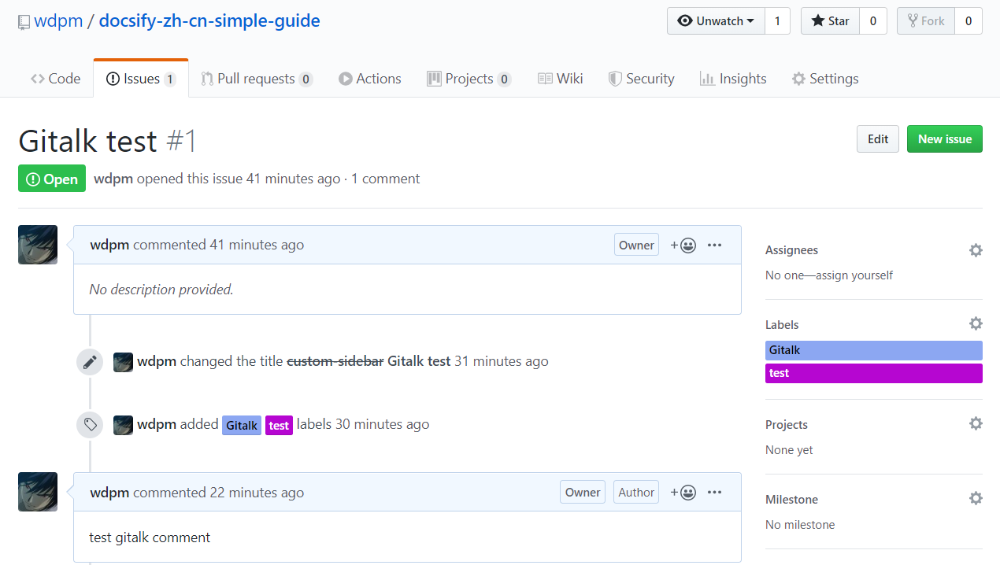

# 插件列表


## 全文搜索

 全文搜索插件根据当前页面上的超链接获取文档内容，在 `localStorage` 内缓存文档索引，一定时间后会过期。

```html
<script>
  window.$docsify = {
    // 完整配置参数
    search: {
      maxAge: 86400000, // 过期时间，单位毫秒，默认一天
      paths: 'auto', // 或者数组列表
      placeholder: 'Type to search',

      // 支持本地化
      placeholder: {
        '/zh-cn/': '搜索',
        '/': 'Type to search'
      },

      // 支持本地化
      noData: {
        '/zh-cn/': '找不到结果',
        '/': 'No Results'
      },

      // 搜索标题的最大程级, 1 - 6
      depth: 2
    }
  }
</script>
<script src="//unpkg.com/docsify"></script>
<script src="//unpkg.com/docsify/lib/plugins/search.js"></script>
```


## emoji 表情

 需要正确解析 emoji 字符串，可以引入这个插件 。例如 :joy:

```html
<script src="//unpkg.com/docsify/lib/plugins/emoji.js"></script>
```


## 外链脚本

 如果文档里的 script 是内联脚本，可以直接执行；如果是外链脚本，则需要使用此插件。 

```html
<script src="//unpkg.com/docsify/lib/plugins/external-script.js"></script>
```


## 图片缩放

 Medium's 风格的图片缩放插件， 基于 [medium-zoom](https://github.com/francoischalifour/medium-zoom)。 

```html
<script src="//unpkg.com/docsify/lib/plugins/zoom-image.js"></script>
```

 示例。图片来自Pixiv。


忽略某张图片 

```markdown

```


## 在 Github 上编辑

添加 `Edit on github` 按钮。由第三方库提供, 查看 [document](https://github.com/njleonzhang/docsify-edit-on-github) 

```html
<script src="//unpkg.com/docsify-edit-on-github/index.js"></script>
```

```js
  EditOnGithubPlugin.create(
    'your-git-repo-url',
    null,
    function(file) {
        return 'edit on git'
      }
    }
  )
```


## 复制到剪贴板按钮

 添加一个简单的`Click to copy`按钮来允许用户从你的文档中轻易地复制代码。[docsify-copy-code]( https://github.com/jperasmus/docsify-copy-code )

```html
<script src="//unpkg.com/docsify-copy-code"></script>
```

```js
// docsify-copy-code (custom)
copyCode: {
    buttonText : '复制到粘贴板',
    errorText  : '错误',
    successText: '复制成功'
}
```


## Disqus 评论系统

```html
<script>
  window.$docsify = {
    disqus: 'shortname'
  }
</script>
<script src="//unpkg.com/docsify/lib/plugins/disqus.min.js"></script>
```


## Gitalk 评论系统

[Gitalk](https://github.com/gitalk/gitalk)，一个现代化的，基于Preact和Github Issue的评论系统。

```html
<link rel="stylesheet" href="//unpkg.com/gitalk/dist/gitalk.css">

<script src="//unpkg.com/docsify/lib/plugins/gitalk.min.js"></script>
<script src="//unpkg.com/gitalk/dist/gitalk.min.js"></script>
<script>
  const gitalk = new Gitalk({
    clientID: 'Github Application Client ID',
    clientSecret: 'Github Application Client Secret',
    repo: 'Github repo',
    owner: 'Github repo owner',
    admin: ['Github repo collaborators, only these guys can initialize github issues'],
    // facebook-like distraction free mode
    distractionFreeMode: false
  })
</script>
```

示例

```html
	<script>
	  const hash=location.hash;
	  let id = "mainPage";
	  if(!hash && hash.length >2 && hash.substr(0, 2) === "#/"){
	    id = hash.substr(2);
	  }
	  const gitalk = new Gitalk({
		clientID: 'fbbb56f2ee144530c49b',
		clientSecret: 'c2004eeed2a120b1d70e49d3da1c0a861ae1a09d',
		repo: 'docsify-zh-cn-simple-guide',
		owner: 'wdpm',
		admin: 'wdpm',
		id: id,
		// facebook-like distraction free mode
		distractionFreeMode: true
	  })
	</script>
```

说明：注意id这个字段。默认赋值为主页 mainPage ；大部分情况应该是特定页面，此时对 location.hash 作处理提取路由作为唯一标志值，例如id可能为 custom-loading 这种形式的值。

接着，你需要在Github 手动创建相应的issue，并赋予正确的 label

下图创建了一个issue，Label标注为 Gitalk 和 test。Gitalk 表示为 Gitalk 评论，test 表示某一个页面的 id。




## 分页导航

 docsify的分页导航插件，由[@imyelo](https://github.com/imyelo)提供。 

```html
<script src="//unpkg.com/docsify/lib/docsify.min.js"></script>
<script src="//unpkg.com/docsify-pagination/dist/docsify-pagination.min.js"></script>
```

